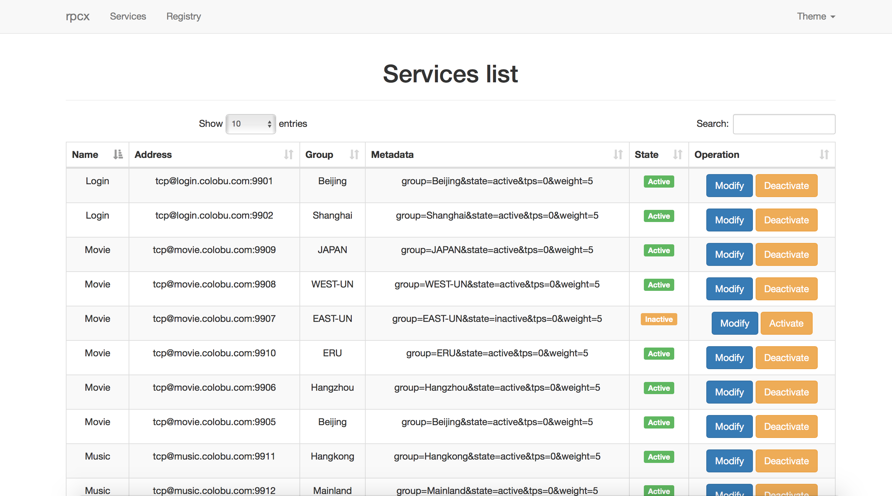
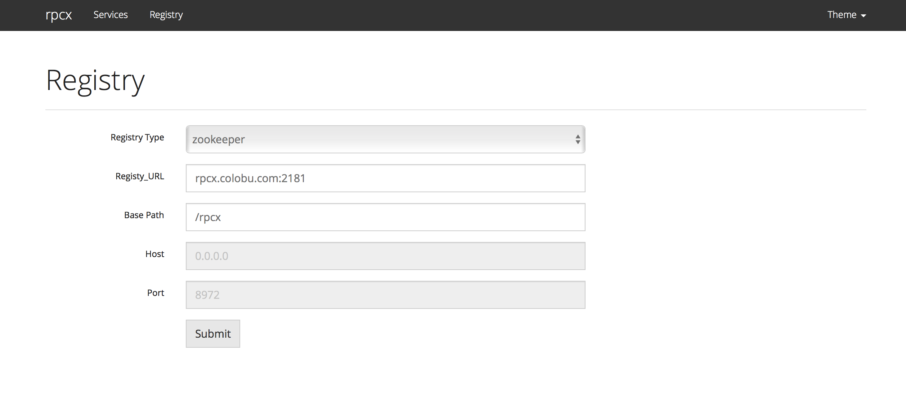

# rpcx-ui

rpcx-ui is web gui for rpcx. It provides services management.






## Configuration
There are two config templates in this repository:

- **config.json**: etcd config templates for etcd registry
- **config_zk.json**: zookeeper config templates for zookeeper registry

Currently rpcx-ui only supports etcd and zookeeper registries. There is no GUI support for consul registry.

If you want to use zookeeper registry, replace config.json with config_zk.json.

```json
{
  "registry_type": "zookeeper",
  "registry_url": "localhost:2181",
  "service_base_url":"/rpcx",
  "host": "0.0.0.0",
  "port": 8972,
  "user": "admin",
  "password": "admin"
}
```

As you see, you need set zookeeper url and services base path.
`host` and `port` is used by rpcx-ui and I support you set host to "127.0.0.1" for security consideration.

`user` and `password` has not been used in current code but I want to add it in future, because **the setting must be operated by administrators**.

## Running

You can run `go build -o rpcx-ui *.go` to create the executable file: `rpcx-ui`.

Put `rpcx-ui`、`config.json`、`web`、`templates` in a directory, for example, `/opt/rpcx-ui`，
and then run `./rpcx-ui` to start this http server.

You can visit `http://localhost:8972/` to visit this GUI.


